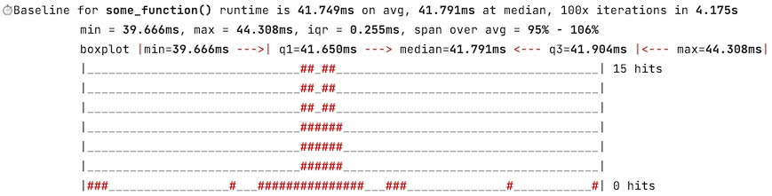

# paceline: beautiful Python performance measurement
## What is it?
**paceline** is a very simple tool to measure the performance of Python 3.x function calls and visualize measurement progress
and results to the console. Although **paceline** shines when output it's result to the console, **paceline** can also 
suppress any visual output and just return a simple Python-dictionary containing the performance measurement result. 
**paceline** has no external dependencies and should run on any platform (although not tested for all).

In addition, the word ***"paceline"*** is hereby introduced as a nice abbreviation for "*simple performance testing*" 
or "*performance testing*" to the developer community. Especially for those who love performance optimization. So... 
> Have you already **pacelined** your code today?

## Features
Here are the the things that **paceline** does (hopefully for your pleasure):
* Measure the runtime of any Python function. If you don't have a function, just wrap your code into a function and measure that. 
* Show a nice progressbar while executing multiple iterations of your Python function to measure performance.
* Evaluate some basic statistics over the runtime variance of your Python function.
* Print the paceline results to the console, or maybe not.
* Print a nice histogram over runtime variations to the console, or maybe not.
* Will return performance results in a simple Python dictionary, is requested.
* Easy to use. Either add the **@paceline(...)** decorator to your function, or apply performance baselining by wrapping 
  and (maybe) unwrapping your function with the **paceline(...)** decorator. All that is shown and explained in the 
  script [demo.py](demo.py) and explained below. 

## How to use?
The basic usage of **paceline** is shown and explained in the script [demo.py](demo.py). Just run the demo.py script, 
and see how it works or check the follwoing code:
```python
from paceline import paceline

# 1. Let's define some functions that we want to paceline (= measure their performance over 1...N iterations).
@paceline(iterations=100, progressbar=True, statistics=True, boxplot=True, histogram=True, return_metrics=False)
def some_function():
    return 1

def some_other_function(loops: int = 1000): # Not: no paceline decorator defined!
    return 1

# 2. If a function has defined the paceline decorator, like some_function(...)
#    then all calls to that function will get measured and evaluated.
result = some_function()

# 3. If no decorator is defined, you to wrap your function into the paceline
#    as shown below. From thereon all calls to the function will get measured...
some_other_function = paceline(some_other_function)
result = some_other_function()

# 4. ...until you (optionally) unwrap the function from the decorator again, like this:
some_other_function = some_other_function.__wrapped__

# 5. If you just interested in the performance figures ONLY - so no output to the
#    console - you need to set <return_metrics=True> and <suppress_output=True>.
#    The <return_metrics> parameter forces the paceline decorator to return a tuple
#    of the function result(s) and the performance metrics contained in a simple
#    dictionary, suitable for any kind of further processing.
some_other_function = paceline(func=some_other_function, iterations=100, return_metrics=True, suppress_output=True)
result, metrics = some_other_function()  # here we get the results and the metrics
```
A call of the decorated some_function()...
```python
result = some_function()
```
will deliver something like this as output, if all options have been set to True:


## Dependencies
None.

## Installation
Clone this GitHub repo or copy the [paceline.py](paceline.py) file to your Python project.  

## License
MIT (see [license.txt](license.txt))

##Getting Help
For help and usage questions, the best place to go to is [StackOverflow](https://stackoverflow.com/questions/tagged/paceline). 

## Discussion, development and contributing to paceline
Development discussions should take place on GitHub in this repo. Any contributions, bug reports, bug fixes, 
documentation improvements, enhancements, and ideas are very welcome. Please let me know, if it would be worth to
extend the concept. There tons of ideas to extend concept of **pacelining**...